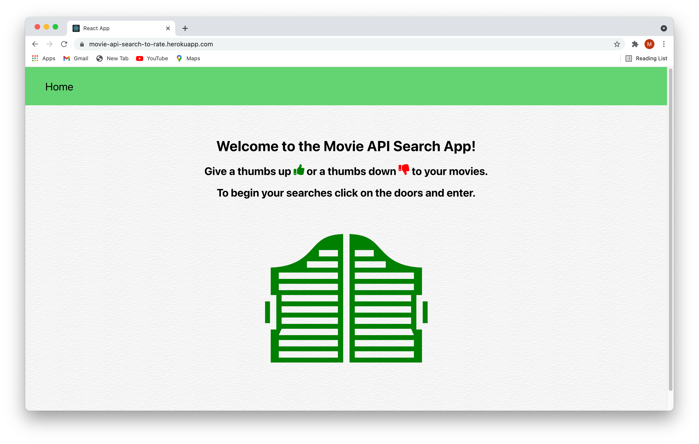

# movie-api-node-app

Visit the site [here](https://movie-api-search-to-rate.herokuapp.com).

## Setup and run on your device

- Create a folder for the project and in your terminal `cd` into it
- Copy and paste this command in your folder: `git clone https://github.com/mendelcohen/movie-api-node-app.git`
- Logon to https://rapidapi.com/collection/movie-apis and obtain an API key (this project uses Movie Database (IMDB Alternative))
- Create a .env file in the root of the project folder to store the api key: `API_KEY = "..."`
- Run `NPM install` in your terminal to install the dependencies
- Run `NPM start` in your terminal to start your server
- In your browser go to `localhost:3001` and the app should load

### Screenshots

